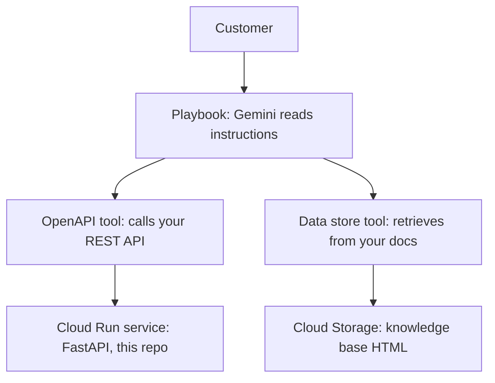

# Grounded support agent on Google Conversational Agents

A working customer-service AI agent built on Google Cloud's Customer Engagement
Suite. It answers questions about a fictional broadband provider's accounts,
checks for network outages, books technician visits, and answers policy
questions from a knowledge base instead of making them up.

The interesting part isn't that it works. It's the failure I found while testing
it, written up in full below.


---

## What this is, in plain English

Imagine the chat window on your internet provider's website. Traditionally that
was a decision tree — press 1 for billing, press 2 for support — and it was
terrible, because real customers don't speak in menu options.

A modern version uses a language model. But a language model on its own has two
problems: it knows nothing about *your* customer, and it will happily invent a
plausible-sounding answer when it doesn't know something. So you give it two
capabilities:

- **Tools** — real API endpoints it can call. "Look up account OPT-10045512."
  The model decides *when* to call them and *what* to pass. The answer comes
  from your systems, not its imagination.
- **A data store** — your actual policy documents, indexed so the model can
  retrieve the relevant passage and answer from that, with a citation.

This repo is one of each, plus the agent that uses them, plus what I learned
about where that arrangement breaks.

---

## How the pieces fit



A **playbook** is a generative agent: you write a goal and numbered instructions
in plain English, and the model reads them and decides what to say and which
tools to call. It's the counterpart to a **flow**, which is a deterministic
state machine you draw by hand. A real deployment uses both — flows for the
parts that must be exact, like identity verification or taking a payment, and
playbooks for the open-ended parts.

---

## What's in the repo

| Path | What it is |
|---|---|
| `app/main.py` | FastAPI service — five tool endpoints, a classic CX webhook, and `/stats` |
| `app/guardrails.py` | Input validation, read/write action policy, confirmation gate, log redaction |
| `app/observability.py` | Per-route P50/P95/P99 latency |
| `app/mock_data.py` | Synthetic accounts, outages, technician slots |
| `openapi/tools.yaml` | The OpenAPI schema the agent reads to know what it can call |
| `openapi/playbook_instructions.md` | The playbook's goal and instructions |
| `datastore/*.html` | Knowledge base documents used for grounding |
| `tests/test_service.py` | 13 tests — happy paths, guardrail rejections, webhook contract |
| `agent-export/` | Exported agent definition (playbooks, tools, config) |
| `scripts/` | Enable APIs, deploy, upload knowledge base, smoke test |

---

## The five tools

Each is a REST endpoint. The `description` fields in `openapi/tools.yaml` are
not documentation — they're the prompt the model reads when deciding what to
call. They're production prompt surface and should be versioned like code.

| Tool | What it does | Side effects |
|---|---|---|
| `get_account_status` | Plan, balance, due date, service status, service ZIP | None |
| `check_outage` | Known network incident for a ZIP code | None |
| `list_appointment_slots` | Real technician arrival windows | None |
| `schedule_technician` | Books a visit | **Yes** — gated |
| `escalate_to_human` | Creates a handoff ticket, routes by sentiment | **Yes** — gated |

---

## What worked: the agent chains tools on its own

Given only `My internet is down, account OPT-20031877`, the agent:

1. called `get_account_status` with that account ID
2. read `service_zip: 11375` out of the response
3. called `check_outage` with `11375`
4. reported the active fiber cut, affected services, and restore time

Nobody told it the ZIP code. It took one tool's output and fed it into the next
tool's input. It also obeyed an ordering constraint in the instructions — check
for an outage *before* offering troubleshooting — so it never suggested
rebooting a router during a fiber cut.

Latency in that trace: **4.497s** on the first call, **0.051s** on the second.
That's a Cloud Run cold start against a warm request, roughly 90x. It's the
concrete reason `min-instances 0` is a demo setting: a four-second silence on a
voice call is a hangup.

---

## What broke: the agent skipped retrieval where it felt confident

The instructions told it to pull troubleshooting steps from the knowledge base.
It ignored that and answered from its own training data.

**Before:**


No `search_support_kb` call in the trace. It advised unplugging the modem for
**30 seconds**. The knowledge base says **60 seconds**, modem back in first,
wait for the online light to go solid. Close enough to sound right, different
enough to be wrong.

The data store itself was fine. A question the model *couldn't* know was
answered correctly, with retrieval and a citation:


So the pattern isn't random. **The model retrieves when it feels uncertain and
skips when it feels confident.** Which means retrieval gets skipped exactly
where the model's general knowledge overlaps your domain — and that overlap is
where your documented procedure differs from the generic answer in small,
plausible ways. The worst possible place to lose grounding.

**The fix** was to make the instruction a precondition rather than a suggestion,
and to name the prohibition explicitly:

```
- If there is no active outage, you MUST call ${TOOL: search_support_kb} before
  giving any troubleshooting step. Do not give troubleshooting advice from your
  own knowledge, even if you are confident it is correct. Give only the steps
  returned by search_support_kb, in the order returned, one step per turn. If
  search_support_kb returns nothing relevant, say you do not have steps for
  that issue and offer a technician visit.
```

**After:**


---

## The lesson: two enforcement layers, only one of which is real

| Layer | Example | What happened |
|---|---|---|
| Prompt instruction | "use the data store for troubleshooting" | **Ignored.** The model decided it already knew. |
| API contract | `confirm: true` required to book a technician | **Cannot be ignored.** HTTP 409 regardless. |

The booking endpoint returns `409 confirmation_required` unless `confirm` is
true, and the rejection message tells the model what to do next so it
self-corrects rather than stalling:


Delete the confirmation line from the playbook instructions entirely and the API
still refuses. That's the difference between a guardrail and a request.

Here's the agent doing it correctly — offering a real slot from
`list_appointment_slots`, waiting for agreement, then booking:


The honest limitation: you can put a *confirmation* requirement in an API
contract, but you cannot put a *retrieval* requirement there. Nothing stops a
model from answering without calling a tool. The only controls are instruction
strength and measurement after the fact — which is why evaluation harnesses
exist, and why "we told it to use the knowledge base" isn't an answer.

---

## Running it yourself

Requires a Google Cloud project with billing enabled.

```bash
# 1. Enable APIs
export PROJECT_ID=your-project-id
bash scripts/00_enable_apis.sh

# 2. Tests first
python -m venv .venv && source .venv/bin/activate
pip install -r requirements.txt
python -m pytest tests -q          # 13 passed

# 3. Deploy the tool service
bash scripts/01_deploy_cloud_run.sh     # prints your service URL

# 4. Upload the knowledge base
bash scripts/02_upload_datastore.sh

# 5. Verify before wiring anything into the agent
bash scripts/03_smoke_test.sh https://your-service.run.app
```

Then in the Conversational Agents console: create an agent, create a data store
tool from the uploaded bucket, create an OpenAPI tool from `openapi/tools.yaml`
(replace `servers.url` with your Cloud Run URL first), and paste the goal and
instructions from `openapi/playbook_instructions.md` into the playbook.

**Sequencing note:** start the data store first. Indexing takes 10–30 minutes
and runs unattended, so kick it off and build everything else while it churns.

---

## Console configuration

| | |
|---|---|
| Tools registered |  |
| OpenAPI tool |  |
| Data store |  |
| Playbook |  |
| Cloud Run |  |
| Latency |  |

---

## What I'd change to ship this

| Demo | Production |
|---|---|
| `--allow-unauthenticated` | Service-agent auth, Cloud Run IAM scoped to the Dialogflow service agent only |
| In-memory mock data | Real backend behind a repository interface, per-tool timeouts, circuit breaking |
| `/stats` in-process | Prometheus histograms into Grafana, alerting on P95 and tool error rate |
| 409s counted as errors | Policy rejections tracked separately from faults — a guardrail firing is correct behavior and shouldn't page anyone |
| Confirmation flag | Same gate plus an immutable audit log of every write, with session ID and transcript reference |
| Manual testing | Golden conversation set replayed on every prompt or tool-description change, scored on tool-call correctness, grounding rate, and task completion |
| `min-instances 0` | At least 1 — the measured cold start was 4.5s |

The evaluation row matters most. Changing a tool description alters model
behavior, which makes it a production change. Without a replay suite you have no
idea what it broke. Conversational Agents ships a Test Cases feature for exactly
this.

---

## Notes

- **All data is synthetic.** Every account, balance, outage, policy and price in
  this repository was invented for a portfolio demo. Nothing here reflects the
  policies, pricing or systems of any real company.
- **The demo project has been torn down**, so the Cloud Run URL in
  `openapi/tools.yaml` no longer resolves. Redeploy with the scripts above to
  get a live one.
- Dialogflow CX was renamed **Conversational Agents**, and CCAI Insights became
  **Conversational Insights**. The Vertex AI Agents console and the Dialogflow CX
  console were merged into one. Documentation still uses all these names
  interchangeably.
